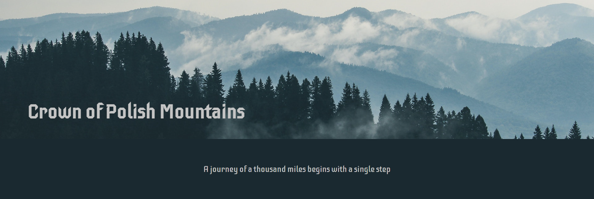
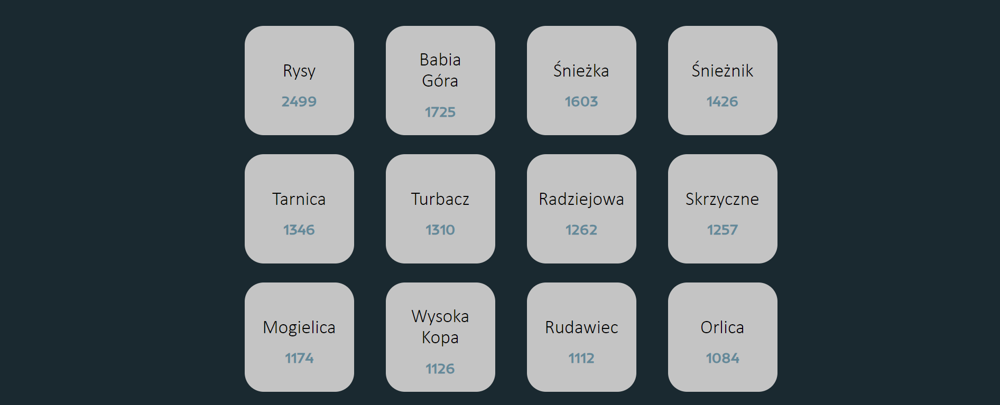
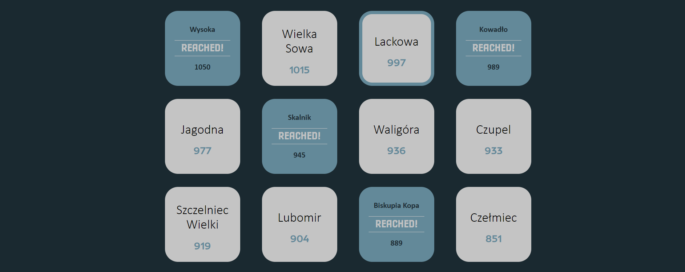

# Crown of Polish Mountains App

I created an app for people who love mountains, hiking and feeling free in the nature. Crown of Polish Mountains is a list of 28 peaks: one from each of the mountain ranges of Poland. User can check which mountains are on the list and what is their a.s.l. height. User can also mark mountains that he has already reached. At the bottom, the app summarizes the total amount of peaks already accomplished.

## Technologies used:
HTML5, CSS3, React, Redux

## Check the website at:
https://calm-crag-62605.herokuapp.com/

## Check the whole project design at:
https://www.behance.net/gallery/142175951/Crown-of-Polish-Mountains-App

## Screenshots

### Header

### Non-clicked cards

### Clicked cards

### Counter

