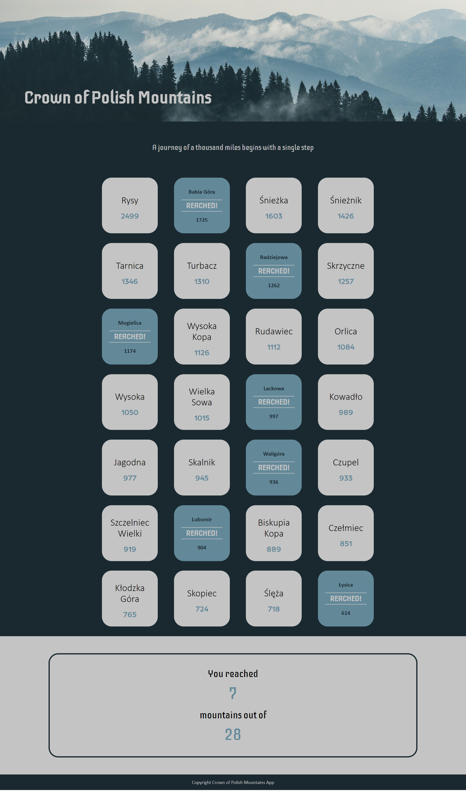

# Crown of Polish Mountains App

It is an app for people who love mountains, hiking and feeling free in the nature. The application allows you to mark Polish peaks that you have already conquered.

## Table of contents

- [General info](#general-info)
- [Technologies](#technologies)
- [Website url](#website-url)
- [Website screenshot](#website-screenshots)

## General info

- the application is built on react components
- react redux was used to store the names and heights of the peaks
- crown of Polish Mountains is a list of 28 peaks: one from each of the mountain ranges of Poland
- user can check which mountains are on the list and what is their a.s.l. height
- user can also mark mountains that he has already reached
- at the bottom, the app summarizes the total amount of peaks already accomplished
- the application is currently made only for desktop view

## Technologies

Project is created with:

- React.js
- React Redux
- JavaScript
- SCSS

## Website url

https://black-grass-023cd2603.5.azurestaticapps.net/

## Website screenshot

